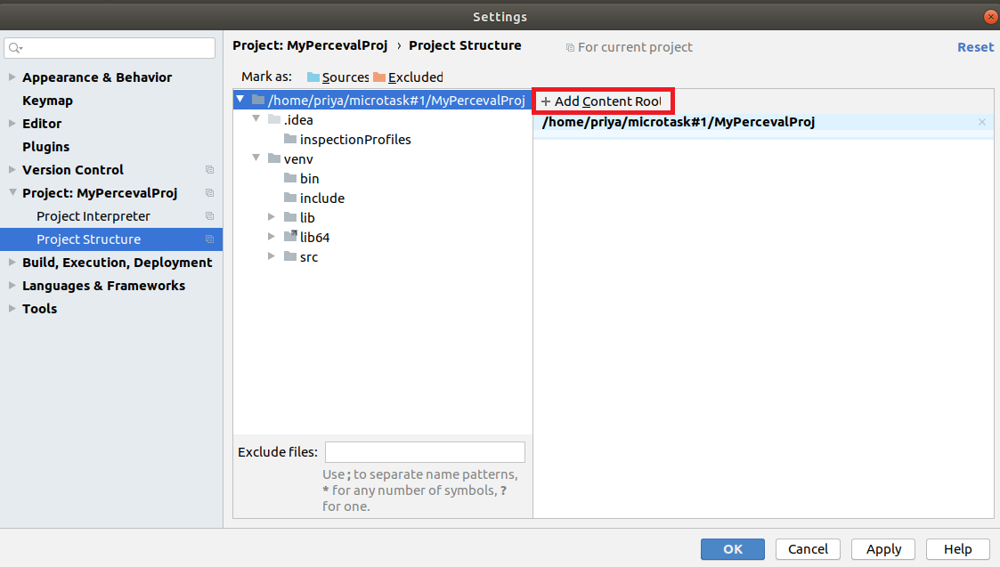
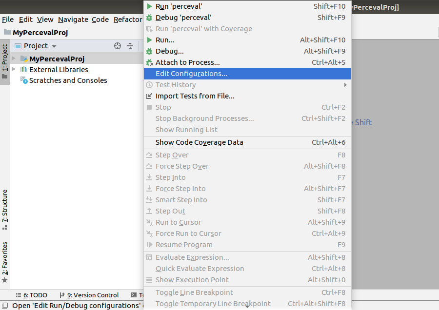
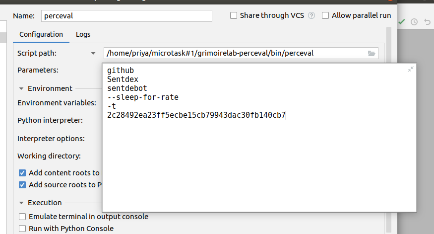
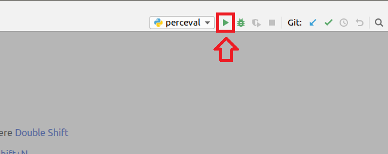
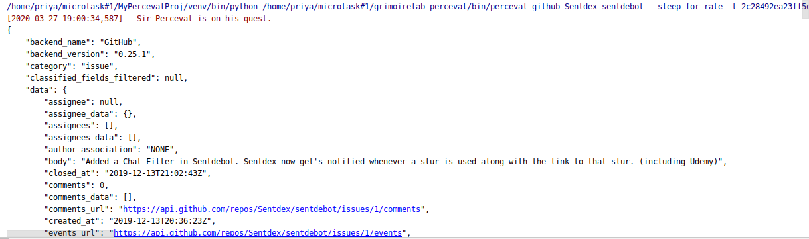

# Microtask #1

Set up Perceval to be executed from PyCharm.

## Development Purpose

* git clone [grimoirelab-perceval](https://github.com/chaoss/grimoirelab-perceval)

* Create a pycharm project .

* Add 'grimoirelab-perceval' to the project structure 

    ```
    file => settings => Project:<your project name> => Project structure => Add Content Root
    ```

    

    ```
    => browse to the cloned 'grimoirelab-perceval' directory 
    ```

    

    ```
    => Apply => Okay
    ```

    Refer the video 'project_structure.mp4' for this step. 

* Install its dependencies using -

    ```
    pip3 install -r <path to grimoirelab-perceval's requirements.txt> 
    ```

* Add configuration for running perceval.

    ```
    run => edit configurations
    ```
    
    

    

    ```
    Script path - mention path to 'grimoirelab-perceval/bin/perceval.py' file.

    github <owner> <repo> --sleep-for-rate -t <github-token>
    ```

    

    ```
    Apply => Okay
    ```

    Run 

    

    Output

    


***

## For Exploration

* Create a Pycharm project

* Execute 
```
pip3 install perceval
``` 

* Verify installation using
```
perceval --help
```


* Run script

```
perceval github <owner> <repo> --sleep-for-rate -t <github-token>
```


***

### More on perceval [here](https://chaoss.github.io/grimoirelab-tutorial/perceval/intro.html) !
