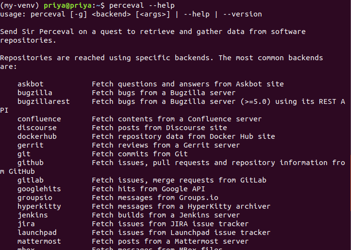
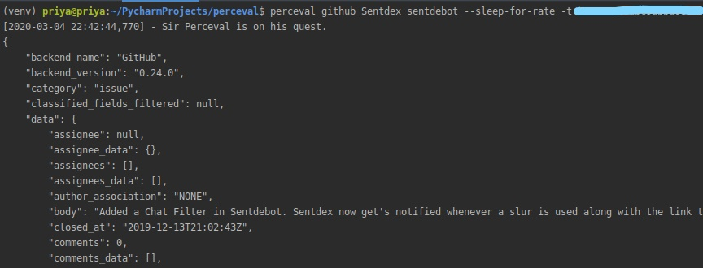

# Microtask #1

Set up Perceval to be executed from PyCharm.

## Development Purpose

* git clone [grimoirelab-perceval](https://github.com/chaoss/grimoirelab-perceval)

* Create a pycharm project .

* Refer below for the setup

    * Add 'grimoirelab-perceval' to the project structure and install its dependencies using -

    ```
    pip3 install -r <path to grimoirelab-perceval's requirements.txt> 
    ```


* Refer below for the demo!

    * Add configuration for running perceval.


***

## For Exploration

* Create a Pycharm project

* Execute 
```
pip3 install perceval
``` 

* Verify installation using
```
perceval --help
```



* Run script

```
perceval github <owner> <repo> --sleep-for-rate -t <github-token>
```



***

### More on perceval [here](https://chaoss.github.io/grimoirelab-tutorial/perceval/intro.html) !
