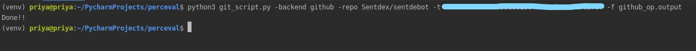
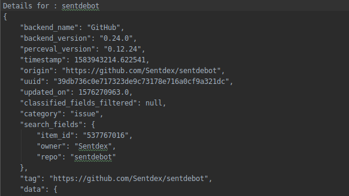
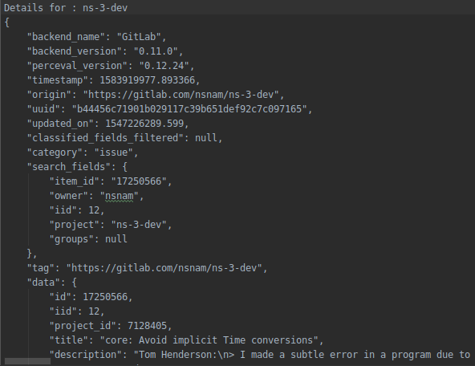

# Microtask #2

Create a Python script to execute Perceval via its Python interface using the GitLab and GitHub backends. Feel free to select any target repository.

Use the command : 
python3 git_script.py -backend <preferred backend> -repo <repo> -t <github_personal_access_token> -f <path of file to save output>

Example:

```bash
python3 git_script.py -backend github -repo Sentdex/sentdebot -t <github_personal_access_token> -f github_op.output
```

```bash
python3 git_script.py -backend gitlab -repo silentprogrammers/vacation_system -t <gitlab_token> -f gitlab_mt2.output
```

Input : 


Output : 

For GitHub backend



For GitLab backend


