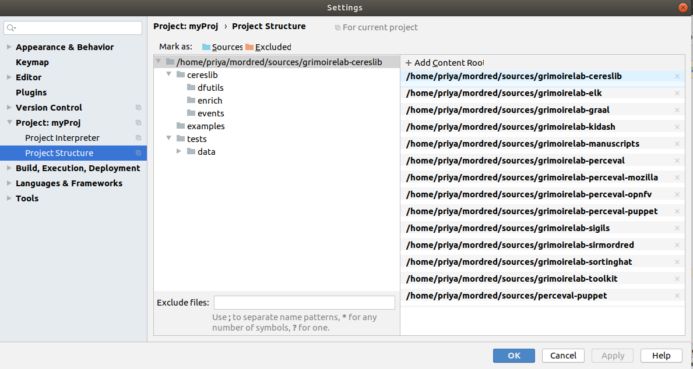

# Microtask #4

Set up a dev environment to work on GrimoireLab. Have a look to https://github.com/chaoss/grimoirelab-sirmordred#setting-up-a-pycharm-dev-environment.

## 1. Run the script 'install_dependencies'

Two text files are needed - 
* dependencies_list(url of forked repo)
* upstream (url of parent)

> Please maintain spaces as mentioned the files attached here.

You may select from two choices - install or update

 * install : First time installation.

 * update : Update the forked repos with the parent repo.

>  The script creates 'sources' folder and adds upstream

Run the following command to install dependencies

```
python3 install_dependencies.py -choice install -file <file_name>
```


Run the following command to update the installed repos

```
python3 install_dependencies.py -choice update -file <file_name>
```

File structure


## 2. Create a project in  'grimoirelab-sirmordred' directory.

## 3. Install grimoirelab dependencies' requirements

Go through 'requirements.txt' files of all the grimoirelab dependencies (the repos we cloned) and install all these according to the versions mentioned.

> Go to File -> Settings -> Project -> Project Interpreter, and then the + located on the top right corner.


## 4. Add all the grimoirelab dependencies to your pycharm project structure



## 5. DOCKER INSTALLATION

Installation for Ubuntu 

[Reference for Docker installation](https://phoenixnap.com/kb/how-to-install-docker-on-ubuntu-18-04)

```
sudo apt-get update
```
```
sudo apt install docker.io
```

```
sudo systemctl start docker
sudo systemctl enable docker
```

To check whether docker has installed correctly.

```
Docker --version 
```


Add user 
```
sudo gpasswd -a $USER docker
```
Create a group

```
newgrp docker
```

Run your first image (hello-world)

If the image is not available locally - docker gets the image from dockerhub.

```
docker run hello-world
```


## 6. INSTALLING 'docker-compose'

Select Linux  at 
[Install Docker compose](https://docs.docker.com/compose/install/)


```
sudo curl -L "https://github.com/docker/compose/releases/download/1.25.4/docker-compose-$(uname -s)-$(uname -m)" -o /usr/local/bin/docker-compose
```

```
sudo chmod +x /usr/local/bin/docker-compose

docker-compose --version
```


## 7. USE DOCKER-COMPOSE

  * [Refer for docker-compose file](https://github.com/chaoss/grimoirelab-sirmordred/blob/master/Getting-Started.md#source-code-and-docker-) 

  * Use a suitable docker-compose yaml file (if you set 'ssl error' with compose file having SearchGuard use the compose file without SearchGuard)
  * For this task, 'docker-compose without SearchGuard' was used.

  > YAML file specifies the versions(images) of the required dependencies used. (YAML files are indentation sensitive).

  * Save this file in a directory for docker files.

  * Add current user to docker group 
  [Refer](https://linoxide.com/linux-how-to/use-docker-without-sudo-ubuntu/)

  ```
  sudo groupadd docker
  sudo gpasswd -a $USER docker
  ```

  * To construct containers -
  ```
  docker-compose up -d
  ```

  Use '-d' to run in 'detatched' mode - logs wont be displayed in the same window, you may have to access them using other commands.

  ```
  docker-compose up 
  ```

  All logs will be displayed in the same window - keep this window live throughout the execution.

  

  View the running containers

  ```
  docker-compose ps
  ```
  

  * Resolve error related to insufficient max_map_count

  ```
  sudo sysctl -w vm.max_map_count=262144
  ```
  AND

  In YAML file - elasticsearch
  ```
      environment:
        - ES_JAVA_OPTS=-Xms1g -Xmx1g
  ```

  * If everything went well, you should be able to see all the containers in 'Up' state after executing 'docker-compose ps'

  * You will also be able to see default pages for kibiter and elasticsearch in the browser.

  localhost://5601

  

  localhost://9200

  

## 8. Visualize

  * Execute the following

  ```
  python3 micro.py --raw --enrich --cfg ./setup.cfg --backends git cocom

  python3 micro.py --panels --cfg ./setup.cfg
  ```

  

  ### Errors you may face

  * Resolve SSL error

  

  Change 'https' to 'http' in the setup.cfg file

  ```
  [es_collection]
# arthur = true
# arthur_url = http://127.0.0.1:8080
# redis_url = redis://localhost/8
url = http://ocalhost:9200

[es_enrichment]
url = http://localhost:9200
```

  * cloc installation

  

  Execute the following -

  [Refer](https://github.com/chaoss/grimoirelab-graal#how-to-installcreate-the-executables)

  ```
  sudo apt-get install cloc
  ```

  * git 'latest_item' error

  

  Make the following changes in setup.cfg

  ```
  latest-items = false
  ```

  ```
  [git]
raw_index = git_chaoss
enriched_index = git_chaoss_enriched
latest-items = false
category = commit
studies = [enrich_demography:git, enrich_areas_of_code:git, enrich_onion:git]
  ```


