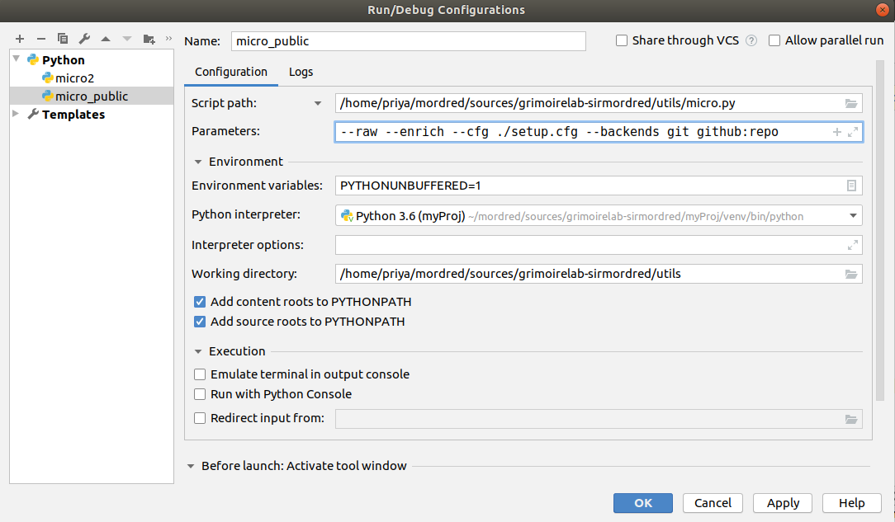
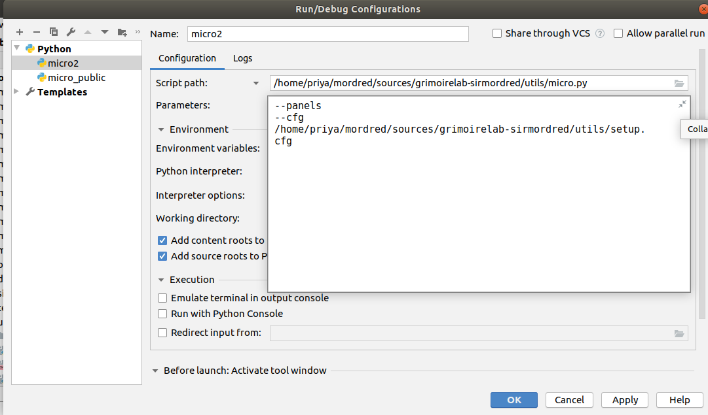

# Microtask #5

Execute micro-mordred to collect, enrich and visualize data from Git and GitHub repositories.

* Add the following to your 'projects.json' file

   ```
   "git": [
      "https://github.com/chaoss/grimoirelab-perceval"
   ]
   "github:repo": [
      "https://github.com/Errichto/coffee-supplier"
   ]
   ```

* Steps to execute micro-mordred

   Create the following configurations 

   * Collect and enrich

   ```
   micro.py --raw --enrich --cfg ./setup.cfg --backends git github:repo
   ```

   

   * Visualize

   ```
   micro.py --panels --cfg setup.cfg
   ```

   

   Run the configurations and visit the browser to view the dashboard (localhost:5601).

***

Git : [chaoss/grimoirelab-perceval](https://github.com/chaoss/grimoirelab-perceval)


GitHub repo : [Errichto/coffee-supplier](https://github.com/Errichto/coffee-supplier)

