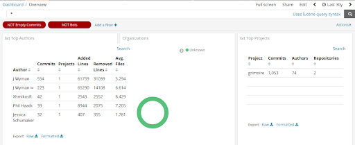
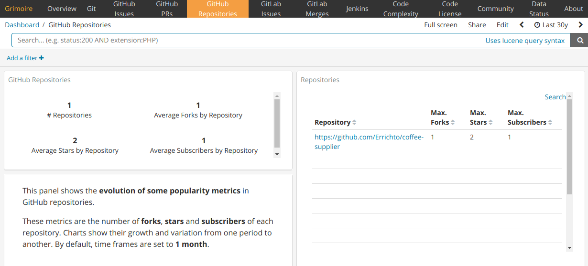

# Microtask #5

Execute micro-mordred to collect, enrich and visualize data from Git and GitHub repositories.

Projects.json

```
"git": [
   "https://github.com/chaoss/grimoirelab-perceval"
]
"github:repo": [
   "https://github.com/Errichto/coffee-supplier"
]
```

Git : [chaoss/grimoirelab-perceval](https://github.com/chaoss/grimoirelab-perceval)



GitHub repo : [Errichto/coffee-supplier](https://github.com/Errichto/coffee-supplier)

