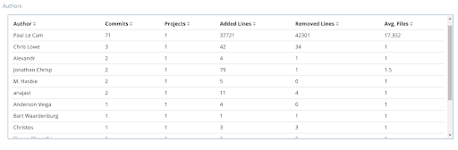

# Microtask #6

Using the dev tools in Kibiter, create a query that counts the number of unique authors on a Git repository from 2018-01-01 until 2019-01-01.

git : [PaulLeCam/react-leaflet](https://github.com/PaulLeCam/react-leaflet)

## Get Count of unique authors

Use "cardinality" aggregation.

Query :
```
GET /git_chaoss/_search
{
  "query": {
    "range": {
      "metadata__updated_on" : {
                "gte": "2018-01-01T00:00:00", 
                "lte": "2019-01-01T00:00:00", 
                "time_zone": "+01:00"
            }
    }
  },
  "size":0,
  "aggs": {
    "uniq_authors": {
      "cardinality": {
        "field": "data.Author"
      }
    }
  }
}
```


```
"value":26
```
This indicates that there are 26 unique authors.

## Get names of unique authors

Use "terms" aggregation with size

> “Size” attribute value must be greater than or equal to  cardinality output values (i.e unique authors count)  so that we get "sum_other_doc_count" as 0 in the output.

```
 "sum_other_doc_count":0
 ```

 Query :

```
GET /git_chaoss/_search
{
  "query": {
    "range": {
      "metadata__updated_on" : {
                "gte": "2018-01-01T00:00:00", 
                "lte": "2019-01-01T00:00:00", 
                "time_zone": "+01:00"
            }
    }
  },
  "size":0,
  "aggs": {
    "uniq_authors": {
      "terms": {
        "field": "data.Author",
        "size": 26
      }
    }
  }
}
```


## Test it using Kibiter !

Dashboard


Author names



