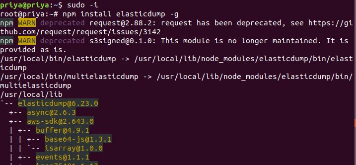
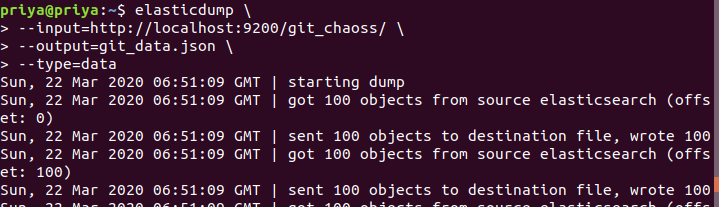
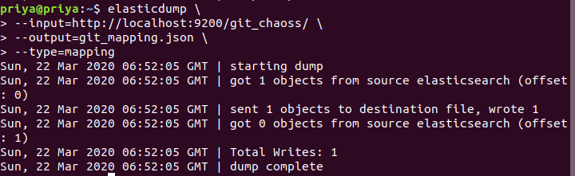
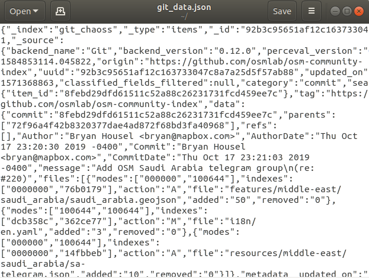
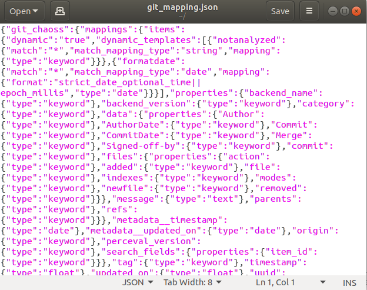

# Microtask #7

Install and use elasticdump to download the mapping and data of an ElasticSearch index (it can be anyone created in Microtask 5).

## Install elasticdump

```
sudo apt install npm
sudo -i
npm install elasticdump -g

```


CTRL+D to logout from root user

## To get data from the index



## To get mapping from the index



This will generate output files 


## OUTPUT 

data file






