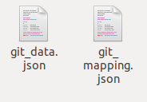

# Microtask #7

Install and use elasticdump to download the mapping and data of an ElasticSearch index (it can be anyone created in Microtask 5).

## Install elasticdump

```
sudo apt install npm
sudo -i
npm install elasticdump -g

```


CTRL+D to logout from root user

***

>### Use the 'type' argument to either fetch data or mapping.


## To get data from the index

```
elasticdump --input=http://localhost:9200/git_chaoss/ --output=git_data.json --type=data
```


## To get mapping from the index

```
elasticdump --input=http://localhost:9200/git_chaoss/ --output=git_mapping.json --type=mapping
```


This will generate output files 



## OUTPUT 

"data" File


"mapping" File


