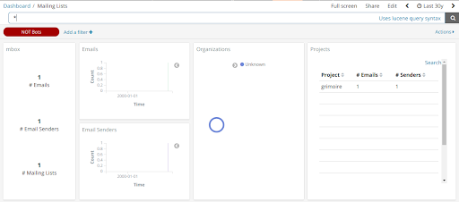
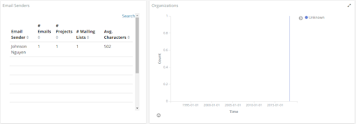
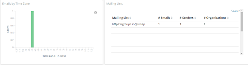
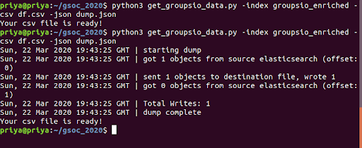
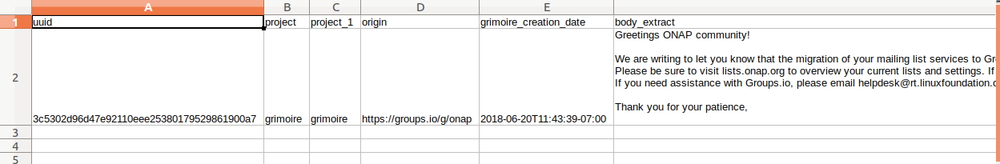
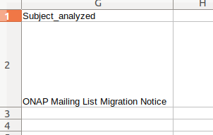

# Microtask #8

Execute micro-mordred to collect and enrich data from a groupsio repository. You need to register to a group (e.g., https://lists.onap.org/g/main) and follow the instructions at https://github.com/chaoss/grimoirelab-sirmordred#groupsio. 

***

Then, write a script to read the enriched index and import the attributes uuid, project, project_1, origin, grimoirelab_creation_date, body and subject_analyzed to a CSV file. Import the obtained file to an excel sheet (in a manual or automatic way).

Output csv file

***

