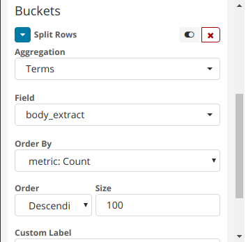
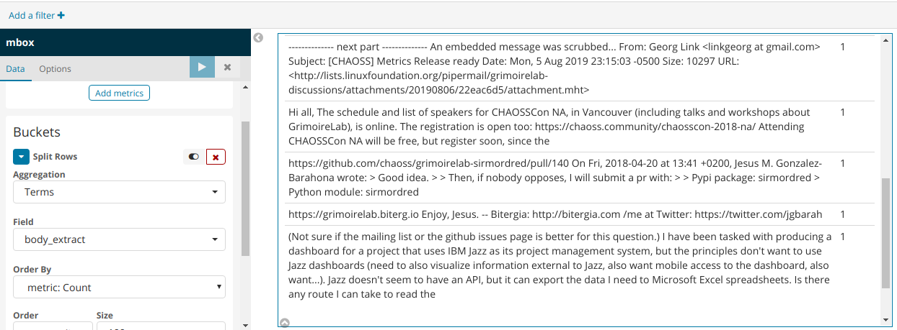

# Microtask #9

Build a Data Table visualization in Kibiter (you can use the CHAOSS community dashboard) that shows for emails (mbox index) the text of emails (split row by Term body_extract field).

Done using [pipermail](https://github.com/chaoss/grimoirelab-sirmordred#pipermail-) 

Configure the follwing settings in buckets section

